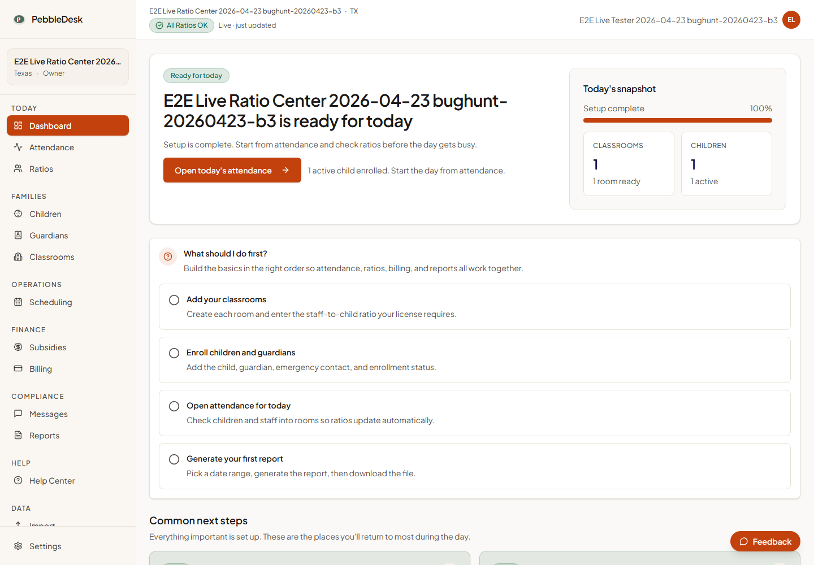
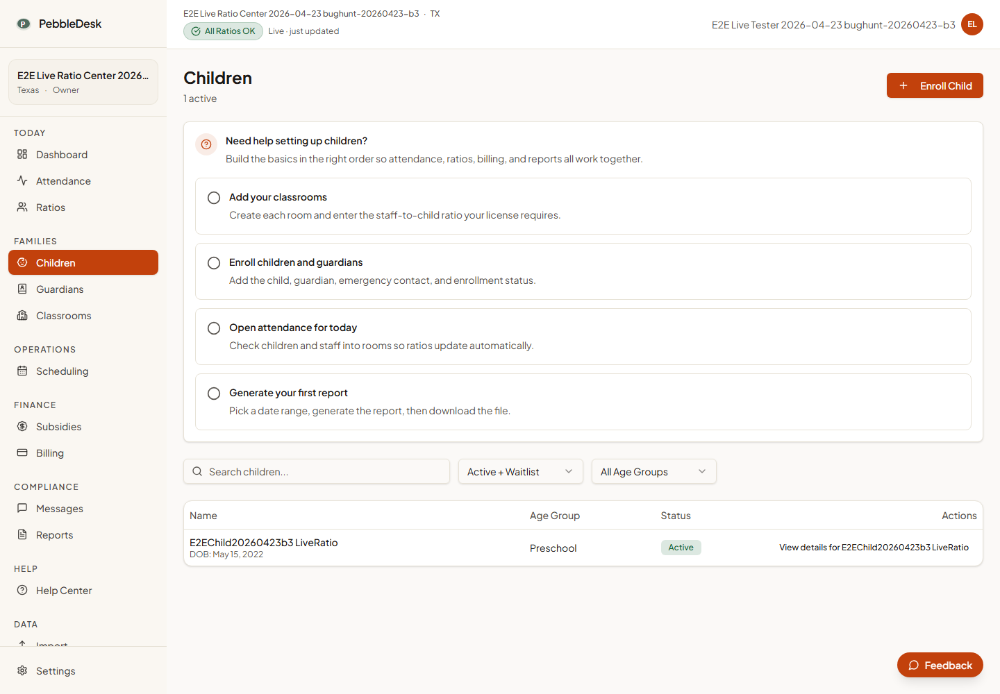
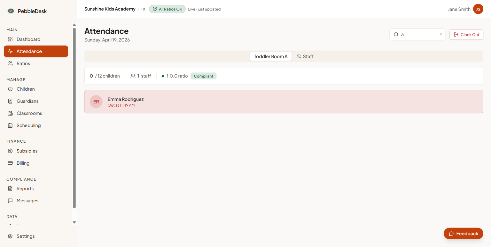
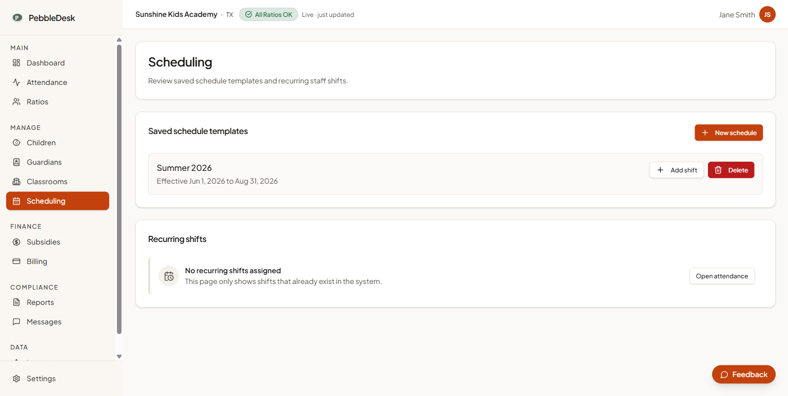
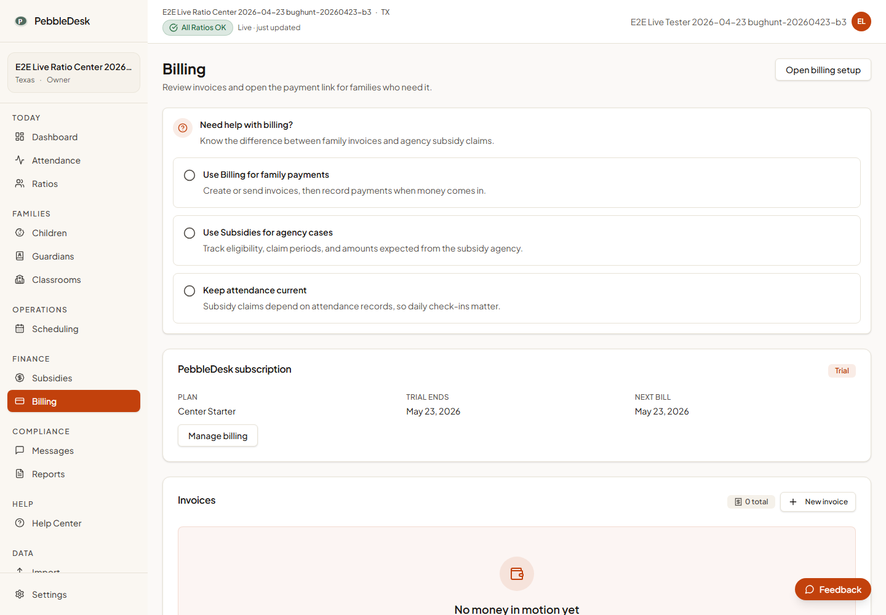
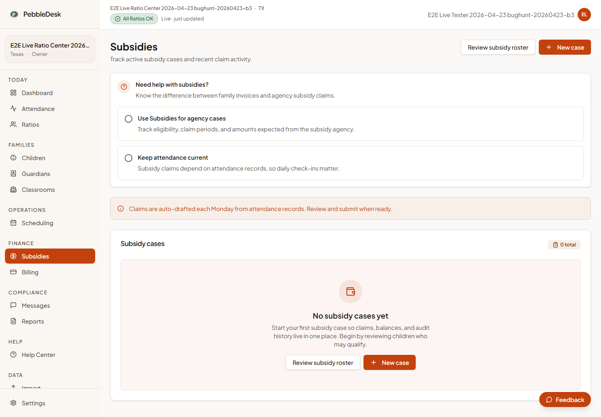
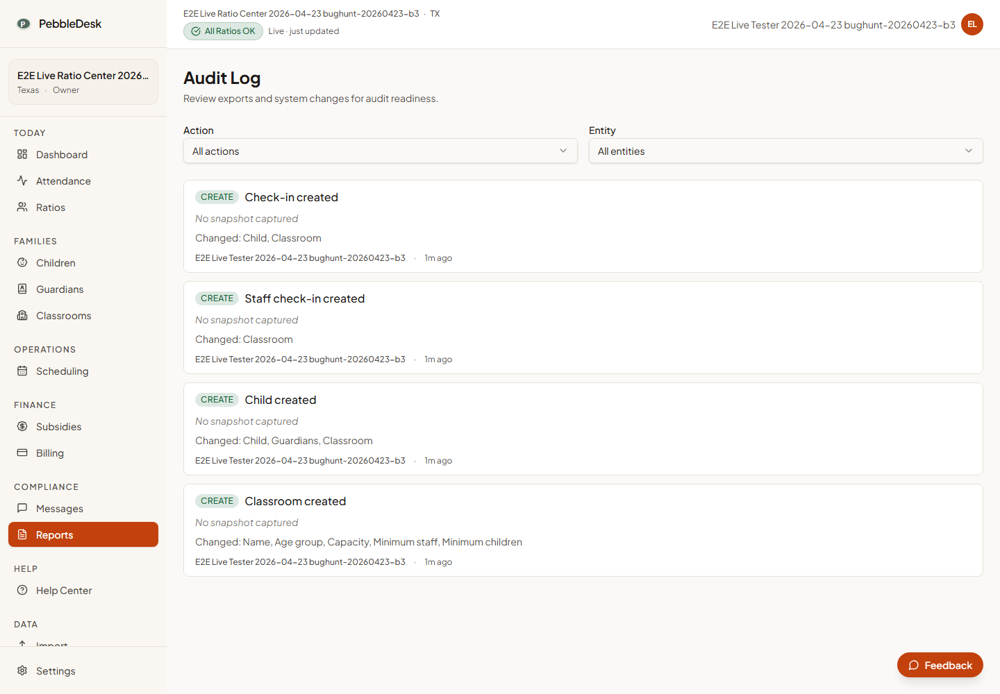
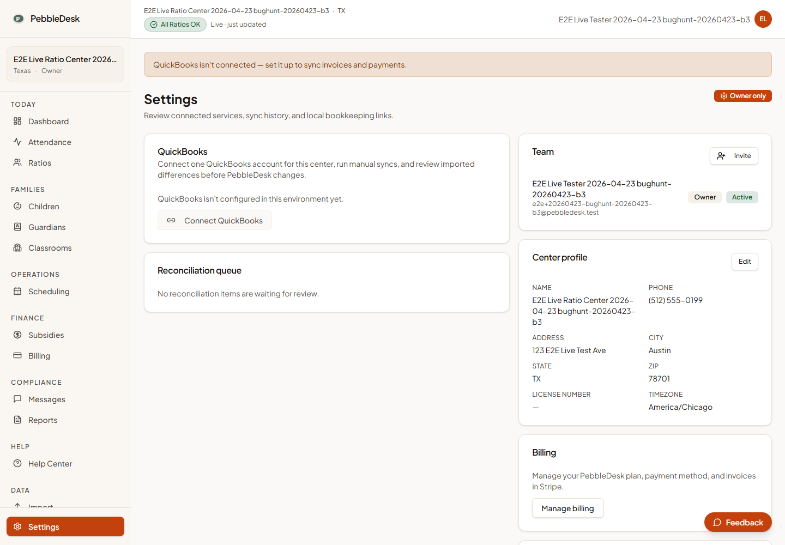
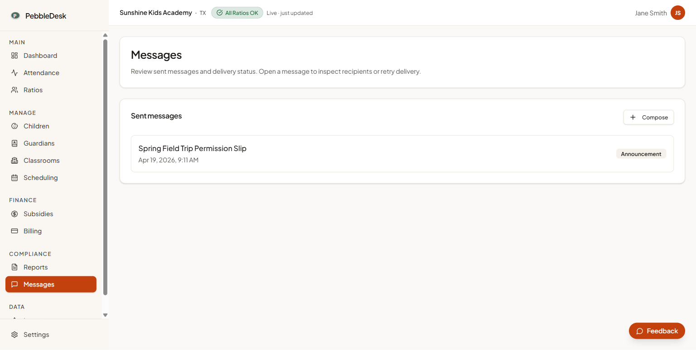
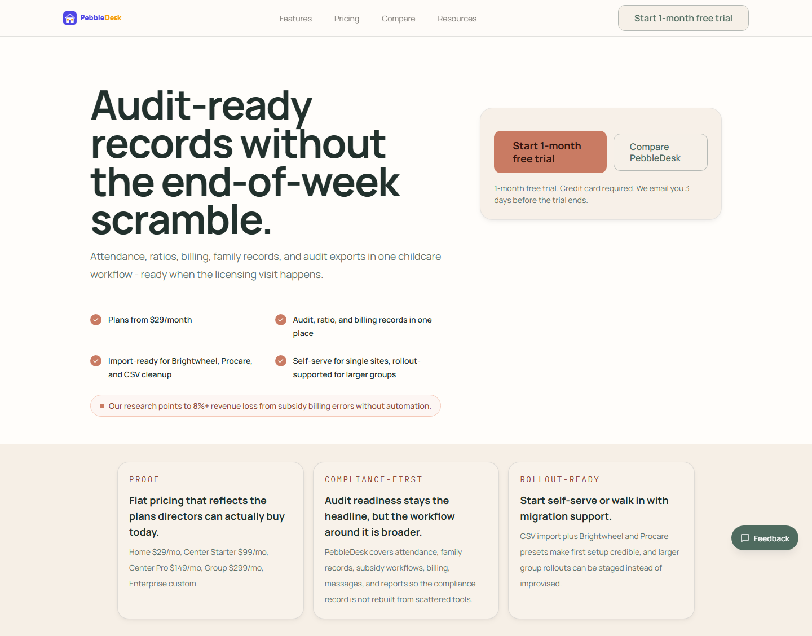

# PebbleDesk

Childcare center administration software for licensed daycare operators: the people who have to
prove to a state inspector that every room stayed inside its staff-to-child ratio, that every
subsidy claim was billed once and only once, and that nobody quietly edited the record afterwards.
It was built for directors working on tablets rather than for IT departments at workstations.

> [!IMPORTANT]
> **Decommissioned on 2026-06-11.** The Workers, the Neon database, the DNS records and the domain
> are all gone, so everything below is past tense. The shutdown ran against a checklist, and the
> checklist recorded which services were confirmed clean and which stayed open, so the shutdown left
> a record rather than an assumption. See
> [portfolio/DECOMMISSIONING.md](./portfolio/DECOMMISSIONING.md).

> [!NOTE]
> Built solo by Angel Campa, with AI-agent assistance disclosed rather than hidden. See
> [Built with AI agents](#built-with-ai-agents). Source-available for reading and evaluation; no
> license is granted to use, copy, modify, or redistribute. See [License](#license).


*The compliance surface, captured from the local stack against seeded data. `Required 1:4` is not a
number the center typed in: it is resolved from the state regulation table against the room's own
policy, whichever is stricter.*

## Contents

- [If you read one thing](#if-you-read-one-thing)
- [What it did](#what-it-did)
- [Architecture](#architecture)
- [Stack](#stack)
- [What's worth your time here](#whats-worth-your-time-here)
- [By the numbers](#by-the-numbers)
- [Testing](#testing)
- [Screenshots](#screenshots)
- [Repository map](#repository-map)
- [Documentation](#documentation)
- [Built with AI agents](#built-with-ai-agents)
- [Running it locally](#running-it-locally)
- [Who built this](#who-built-this)
- [License](#license)

---

## If you read one thing

[The subsidy claim overlap constraint](./portfolio/CONCURRENCY.md#the-toctou-race-that-mattered) is
`packages/db/drizzle/0067_subsidy_claim_no_overlap.sql`, 53 lines, of which roughly a third are a
comment explaining why the obvious implementation does not compile.

The obvious version is `daterange(period_start::date, period_end::date, '[]')`. Postgres rejects
it: `text::date` is `STABLE`, not `IMMUTABLE`, because it depends on the `DateStyle` setting, and
constraint expressions must be immutable. The shipped version builds the dates out of `substr`,
an integer cast and `make_date`, all of which are immutable:

```sql
ALTER TABLE "subsidy_claims"
  ADD CONSTRAINT "subsidy_claims_no_overlap"
  EXCLUDE USING gist (
    "center_id" WITH =,
    "subsidy_case_id" WITH =,
    (daterange(
      make_date(substr("period_start", 1, 4)::integer, substr("period_start", 6, 2)::integer, substr("period_start", 9, 2)::integer),
      make_date(substr("period_end",   1, 4)::integer, substr("period_end",   6, 2)::integer, substr("period_end",   9, 2)::integer),
      '[]'
    )) WITH &&
  );
```

The migration refuses to install itself if the table already contains overlapping periods, rather
than failing halfway through. The same pattern, with half-open `numrange` semantics instead of
inclusive `daterange`, guards staff shift scheduling in `0066_shifts_no_overlap.sql`.

---

## What it did

A licensed childcare center operates under a state-mandated maximum number of children per staff
member. Two staff submitting a subsidy claim for overlapping weeks is not a bad form entry, it is
double-billing a government program, and an application-level "does this overlap?" check cannot
stop it: two concurrent requests can both read "no" and both insert. PebbleDesk pushed that rule
into Postgres itself as a GiST exclusion constraint, and taught the API to catch the resulting
`23P01` and turn it back into a clean `409`. The same technique guards staff shift scheduling.

Day to day, PebbleDesk tracked attendance and staff-to-child ratios in real time, enrolled children
and their guardians, ran classroom scheduling, billed families and tracked state subsidy claims,
logged every mutation to a centralized audit trail, and imported existing rosters from competing
products. It shipped an Astro marketing site of 31 pages alongside the app, plus 9 `.ts` data/API
route handlers (`llms.txt`, `rss.xml`, `pricing.txt`, and five `ai/*.json` endpoints) under the
same `apps/site/src/pages/` tree.

## Architecture

Browser → Cloudflare Worker → Hyperdrive → Neon Postgres, with a Durable Object in the loop for
rate limiting. Three apps (`web`, `api`, `site`) share five internal packages through a pnpm/
Turborepo workspace, and every tenant-scoped table carries a `center_id` enforced by composite
foreign keys, not just application-level filtering. Full detail, including what Workers forced
(no connection pooling without Hyperdrive, isolate-reused module state, Durable Objects for
anything stateful) and where the tenancy guarantee is discipline rather than a generic check:
[portfolio/ARCHITECTURE.md](./portfolio/ARCHITECTURE.md).

## Stack

| Layer | Technology |
|---|---|
| App frontend | React 19, Vite, TanStack Router + Query, Shadcn/UI (new-york), Tailwind CSS 4 |
| Marketing frontend | Astro 5 |
| Backend | Hono on Cloudflare Workers |
| Database | Neon Postgres via Hyperdrive, Drizzle ORM |
| Auth | Better Auth (email/password + Google OAuth) |
| Validation | Zod |
| Payments · email | Stripe, Resend |
| Tooling | Biome, Turborepo, pnpm, Vitest |

## What's worth your time here

- **A race condition closed in the database, not in the application.** `EXCLUDE USING gist` on a
  computed `daterange`, plus the `IMMUTABLE` workaround Postgres forces on you, plus error `23P01`
  translated back into a tested `409`, now with a flowchart of the race itself. Subsidy claims and
  staff shifts get this database-level protection; attendance check-ins still rely on an
  application-level overlap check.
  → [CONCURRENCY.md](./portfolio/CONCURRENCY.md)
- **A compliance model that cites its sources.** 18 staff-to-child ratio rules across three states,
  each carrying its legal citation in the same struct as the number, and a resolver that always
  picks the stricter of state rule versus center policy.
  → [COMPLIANCE-MODEL.md](./portfolio/COMPLIANCE-MODEL.md)
- **Where "audit-ready" was overstated.** The audit log is real and genuinely centralized: one
  middleware, every mutating route. It is also not tamper-evident: no hash chain, no revoked
  privileges, nothing stopping a direct `UPDATE`. The product name claimed more than the schema
  delivered, and the screenshot in the Screenshots section below shows the honest UI consequence.
  → [COMPLIANCE-MODEL.md](./portfolio/COMPLIANCE-MODEL.md#what-audit-ready-did-not-mean)
- **A 47-defect self-audit that stayed in the repository after it was addressed.** The inventory was
  not deleted once the defects were fixed, so both states are still readable: 63 mutation call sites
  sharing 5 toast notifications between them, and the code that now handles them. The write-up
  quotes the as-found and as-shipped version of each.
  → [ENGINEERING-LOG.md](./portfolio/ENGINEERING-LOG.md)
- **Every number on this page, with the command that produced it.**
  → [METRICS.md](./portfolio/METRICS.md)

## By the numbers

**88,514 lines of application source · 168,704 lines of test across 480 test files · 7,818 test
cases · 44 tables · 68 migrations · 1,443 commits between 2026-04-07 and 2026-07-08**

| Number | Value |
|---|---:|
| Application source lines (non-test) | 88,514 |
| Test lines | 168,704 |
| Test files | 480 |
| Test cases (static count; see [METRICS.md](./portfolio/METRICS.md#counting-test-cases)) | 7,818 |
| Database tables | 44 |
| Migrations | 68 |
| API route modules | 34 |
| Route files under `apps/site/src/pages/` (31 `.astro` pages, 9 `.ts` data/API endpoints; see [METRICS.md](./portfolio/METRICS.md#surface-area)) | 40 |
| Workspace packages | 6 |
| Images in this export | 132 (106 are QA/E2E screenshots) |
| Source-repository commits (not this export's) | 1,443, 2026-04-07 to 2026-07-08 |

Every figure above has the exact shell command that produces it in
[portfolio/METRICS.md](./portfolio/METRICS.md), including two counting mistakes that were caught and
corrected while building this record: a `tail -1` on a batched `wc -l` that understated line counts
thirty-fold, and a naive `it(` grep that both over- and under-counts test cases for different
reasons. Both are documented because the failure mode is more instructive than the number.

## Testing

168,704 lines of test against 88,514 lines of application source, roughly 1.9:1, a ratio the
repository's own `CLAUDE.md` mandates (TDD, 95% per-file coverage) rather than one that happened by
convention. `apps/api/vitest.config.ts` enforces `{ lines: 95, functions: 95, statements: 95,
branches: 85 }` at the tool level via the v8 coverage provider, with branch coverage deliberately
set lower because v8 counts every `?.`/`??` as a separate branch.

**7,818 is a static count of the test cases written in the tree.** A one-time verification run
(documented in [METRICS.md](./portfolio/METRICS.md#counting-test-cases)) put the real runtime case
count at 8,959, a 14.6% gap from `it.each` expansion, confirming magnitude only. The project's own
47-defect audit found specific test gaps (mocked hooks that never assert user-facing feedback,
parsers fed only valid shapes, timezone tests that run in the CI runner's own zone), and
[TESTING.md](./portfolio/TESTING.md) checks which of those gaps still hold against this tree and
which have since been closed.

## Screenshots

All captured from the local stack against seeded data: synthetic centers, synthetic children,
synthetic guardians. Curated from the 106 raw captures in
[`docs/qa/screenshots/`](./docs/qa/screenshots/) into
[`portfolio/screenshots/`](./portfolio/screenshots/); some carry visible QA/E2E run identifiers in
the header, which is honest evidence of how they were produced, not a defect.

<table>
<tr>
<td width="50%" valign="top">

<br><b>Dashboard.</b> The first-run checklist and today's snapshot.
</td>
<td width="50%" valign="top">

<br><b>Children.</b> Enrollment roster with age group and status.
</td>
</tr>
<tr>
<td width="50%" valign="top">

<br><b>Attendance.</b> Per-room check-in state feeding the ratio engine directly.
</td>
<td width="50%" valign="top">

<br><b>Scheduling.</b> Saved templates and recurring staff shifts.
</td>
</tr>
<tr>
<td width="50%" valign="top">

<br><b>Billing.</b> Family invoices, kept distinct from agency subsidy claims.
</td>
<td width="50%" valign="top">

<br><b>Subsidies.</b> The screen behind the overlap constraint in CONCURRENCY.md.
</td>
</tr>
<tr>
<td width="50%" valign="top">

<br><b>Audit log.</b> "No snapshot captured": the gap COMPLIANCE-MODEL.md names directly.
</td>
<td width="50%" valign="top">

<br><b>Settings.</b> QuickBooks connection state, team, and center profile.
</td>
</tr>
<tr>
<td colspan="2" valign="top">

<br><b>Messages.</b> Family-facing announcements and delivery status.
</td>
</tr>
<tr>
<td colspan="2" valign="top">

<br><b>Marketing site.</b> The Astro-built public site, 31 pages plus 9 <code>.ts</code> data/API
routes. Cropped to the hero and value-proposition section; the original 9,024px full-page capture is
<a href="./docs/qa/screenshots/2026-04-23-live-e2e/01-marketing-desktop.png">docs/qa/screenshots/2026-04-23-live-e2e/01-marketing-desktop.png</a>.
</td>
</tr>
</table>

## Repository map

```text
pebbledesk/
├── portfolio/            - retrospective write-ups for a reader (start here)
│   ├── README.md
│   ├── ARCHITECTURE.md
│   ├── CONCURRENCY.md
│   ├── COMPLIANCE-MODEL.md
│   ├── ENGINEERING-LOG.md
│   ├── TESTING.md
│   ├── METRICS.md
│   ├── DECOMMISSIONING.md
│   └── screenshots/      - curated product captures referenced from these docs
├── apps/
│   ├── web/              - React 19 + Vite SPA, TanStack Router/Query (dev :3040)
│   ├── api/              - Hono on Cloudflare Workers, 34 route modules (dev :8790)
│   └── site/             - Astro 5 marketing site, 31 pages + 9 .ts data/API routes (dev :4321)
├── packages/
│   ├── db/               - Drizzle schema (44 tables), 68 migrations, Neon
│   ├── auth/             - Better Auth: email/password + Google OAuth
│   ├── shared/           - Zod validators, types, the state ratio tables
│   ├── ui/               - Shadcn/UI (new-york), Tailwind, design tokens
│   ├── emails/           - transactional email templates
│   └── marketing/        - shared Astro layouts and SEO primitives
├── docs/                 - working documents: audits, plans, specs, QA captures
│   ├── audit/            - the cycle-1 defect inventory and code reviews
│   ├── decommissioning/  - the raw shutdown record, dated 2026-06-11
│   └── qa/screenshots/   - 106 raw captures from QA and E2E passes
└── scripts/              - repo automation; the deploy scripts now refuse to run
```

## Documentation

[`portfolio/`](./portfolio/) holds the retrospective write-ups above, indexed with a summary and
length for each file in [portfolio/README.md](./portfolio/README.md).
[`docs/`](./docs/) holds the prospective working record this snapshot was built from: dated audits,
phase plans, design specs, QA sweeps, and the raw decommissioning checklist, kept as-is rather than
rewritten for a reader. [`portfolio/COMPLIANCE-MODEL.md`](./portfolio/COMPLIANCE-MODEL.md) is this
repository's security-and-privacy document: it covers PII redaction rules for children's medical
notes, allergies, dates of birth, and guardian contact details, plus the audit log's integrity
model and where it falls short.

## Built with AI agents

Of the source repository's 1,443 commits, 39 were authored by an agent account
(`ai.alex@ventoralabs.com`); the remaining 1,404 by one human. That breakdown is recorded in
[`docs/source-history.json`](./docs/source-history.json), written at export time because this
squashed snapshot has no commit history of its own to recount it from.

This repository itself is a single-commit export, taken at commit `78c08934` on 2026-08-13, of that
1,443-commit private repository. It holds the working tree and none of the history, so the commit
figures above describe the source repository, not this export. Scratch files, loose screenshots, and
local secrets were removed at export time; no personal data was removed, because none was found:
every fixture name, center, child, and guardian in all 106 screenshots is invented.

`CLAUDE.md`, `AGENTS.md` and `.claude/` are committed on purpose and describe how the work was
actually done, not scrubbed to look human-only. One concrete thing that process enforced, verifiable
in this tree: `apps/api/vitest.config.ts` sets hard coverage thresholds (95% lines/functions/
statements, 85% branches) under the v8 provider, not just a written policy: a file that drops
below those numbers fails the build. See [Testing](#testing).

The project's own 47-defect self-audit ([ENGINEERING-LOG.md](./portfolio/ENGINEERING-LOG.md)) is
itself agent-assisted-development evidence worth naming: a self-directed sweep for defects, kept in
the repository after the defects it found were fixed, rather than deleted once it stopped being
flattering.

## Running it locally

The hosted services no longer exist, and the deploy scripts under `scripts/cloudflare/` throw by
design so that nothing can recreate them. What still works locally:

```bash
pnpm install
pnpm test        # vitest across the workspace
pnpm typecheck   # turbo typecheck
pnpm lint        # biome check
```

`pnpm dev` needs a Postgres URL and the secrets listed in `apps/api/.dev.vars.example`. There is no
database to point it at.

## Who built this

Angel Campa, solo, from the first commit on 2026-04-07 to the last on 2026-07-08, with an agent
account contributing 39 of the 1,443 commits along the way (see
[Built with AI agents](#built-with-ai-agents)). Questions about anything in here, including the
parts documented as unresolved, are welcome:
[github.com/AngelCampa1](https://github.com/AngelCampa1).

## License

Source-available for reading and evaluation. All rights reserved; no license is granted to use,
copy, modify, or redistribute. See [LICENSE](./LICENSE).
