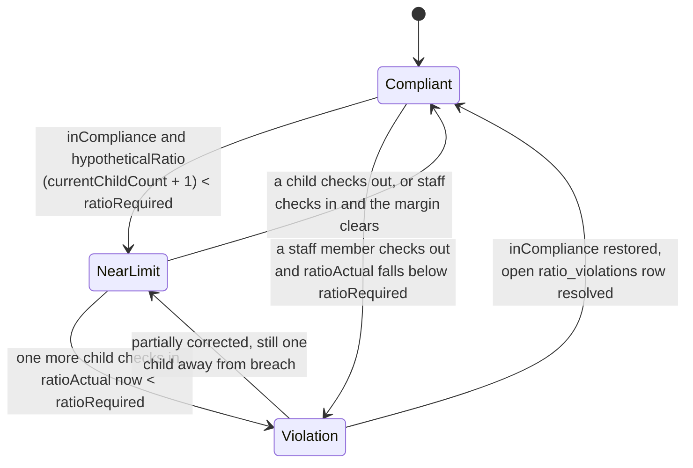

# The compliance model

PebbleDesk called itself "The Audit-Ready Childcare Platform". Two subsystems carried that claim:
the staff-to-child ratio engine, and the audit log. One of them holds up well. The other is real,
useful, and does not mean what the product name implied.

## Contents

- [Why ratios are the whole business](#why-ratios-are-the-whole-business)
- [The rule table cites its sources](#the-rule-table-cites-its-sources)
- [Stricter-of, not nearest-match](#stricter-of-not-nearest-match)
- [The audit log](#the-audit-log)
- [Redaction: an audit log for children's data](#redaction-an-audit-log-for-childrens-data)
- [What "audit-ready" did not mean](#what-audit-ready-did-not-mean)
- [If it had continued](#if-it-had-continued)

---

## Why ratios are the whole business

A licensed childcare center operates under a state-mandated maximum number of children per staff
member, varying by the age of the children. Exceeding it is not a policy breach, it is a licensing
violation, and licensing violations are what close centers down. An inspector can arrive
unannounced and ask what the ratio was in a specific room at a specific time last Tuesday.

That framing sets the requirements. The ratio is not a report to be generated on demand; it is a
continuously evaluated status with a history that has to survive being asked about later. The UI
reflects that: a persistent header pill, three counters (Compliant, Near Limit, Violation), and a
"Live · Updates every 15 seconds" label.

The 15-second polling interval is a decision recorded in the repository's own `CLAUDE.md`:

> Polling (15s) for ratio dashboard, not WebSockets

For a screen watched by one or two people per center, on tablets, on center wifi, a poll is easier
to reason about than a socket that has to survive sleeping tablets and reconnect cleanly. The cost
is up to 15 seconds of staleness on a compliance display, which is defensible when the underlying
events (a check-in, a staff clock-out) are themselves minutes apart.

Each poll recomputes a room's status from scratch in
[`apps/api/src/routes/ratios.ts`](../apps/api/src/routes/ratios.ts): there is no persisted status
field that transitions on its own. What *does* persist is a `ratio_violations` row, opened when a
room falls out of compliance and resolved when it returns to compliance, which is how a director can
answer "was this room ever in violation today" instead of only "is it in violation right now":



`nearLimit` is not a buffer or a second threshold on the ratio itself: it answers one specific
question, "would checking in one more child breach this room's ratio right now", computed directly
against `ratioRequired` on every poll (`apps/api/src/routes/ratios.ts:160-178`). A room can be
`Compliant` at 1:3 in a 1:4 room (not near limit) or `Compliant` at 1:4 in the same room (near
limit, one child from `Violation`): the state depends on how much headroom is left, not on the
count alone.

## The rule table cites its sources

The rules live in
[`packages/shared/src/constants/state-ratios.ts`](../packages/shared/src/constants/state-ratios.ts).
Three states, six age groups each: 18 rules. The shape is the interesting part:

```ts
export type StateRatioRule = {
  /** Staff count in the ratio (numerator) */
  staff: number;
  /** Maximum children per staff (denominator) */
  children: number;
  /** Legal citation for the rule */
  citation: string;
};
```

The citation sits in the same struct as the numbers, not in a comment above the table and not in a
separate documentation file. Texas rows carry `"TX Admin Code 746.3303"`, California rows
`"CA Title 22 §101216.3"`, and the Florida rows go down to the subsection that states each
individual number: `"FL 65C-22.001(5)(a)1"` for infants through `"FL 65C-22.001(5)(a)5"` for
school-age.

This matters more than it looks. A regulatory constant with no provenance is unmaintainable: two
years later nobody can tell whether `preschool: 15` came from the statute, from a customer's
request, or from a typo, and so nobody dares change it. Attaching the citation to the value makes
the table auditable by a non-programmer: a director or a licensing consultant can check the number
against the code it cites without reading TypeScript.

It also makes the numbers falsifiable, which is the honest position for a team without in-house
regulatory expertise. The claim is not "these ratios are correct", it is "these ratios are what
this citation says, go and check".

`grep -c 'citation' packages/shared/src/constants/state-ratios.ts` returns **20**: the 18 rules
plus the type definition and one comment.

Three states is a small table, and that is a genuine limitation rather than a starting point that
happened to be reached. There are fifty. The header block names the three sources in full:

```ts
// Texas HHSC Minimum Standards for Licensed Child Care Centers (746)
// California Title 22 CCR §101216.3 - Staff-Child Ratio Requirements
// Florida 65C-22.001 - Child Care Standards
```

## Stricter-of, not nearest-match

A center has its own per-classroom policy, which may be tighter than the state minimum: a selling
point for parents, and sometimes a condition of accreditation. So there are two rules in play for
every room, and the system has to choose.

`resolveEffectiveRatioRule()` picks whichever is stricter, and the subtlety is in what it returns:

```ts
if (stateRule !== null && isStateRatioStricter(stateRule, input.minRatioChildren, input.minRatioStaff)) {
  // State rule wins: express the effective rule in the state rule's own
  // terms so ratioRequired reflects the state requirement, not a blend of
  // the classroom's staff count with the state's children count.
  return {
    minRatioStaff: stateRule.staff,
    minRatioChildren: stateRule.children,
    ratioRequired: stateRule.staff / stateRule.children,
    ratioRuleSource: `state:${input.centerState}`,
  };
}
```

The comment names the bug that was avoided. The tempting implementation takes `min()` of each field
independently (the classroom's staff number and the state's children number) and produces a rule
that exists in neither source. A room with a 2:8 classroom policy in a state requiring 1:4 would
come out as 2:4, which is stricter than both and which no inspector would recognise. The fix is to
return one rule or the other whole, and to record which one won in `ratioRuleSource` so the UI can
say `Required 1:4` and attribute it.

That attribution is what makes the screenshot on the front page mean something: `Required 1:4` on a
`toddler` room is not a number the center typed in.

The rule table has **31** test cases
([`state-ratios.test.ts`](../packages/shared/src/constants/state-ratios.test.ts),
`grep -c "it(" ...`): more tests than rules, because the stricter-of resolution and the
unknown-state fallback need cases the table itself does not have.

## The audit log

The audit log is genuinely centralized, and that is its best property. One middleware,
[`apps/api/src/middleware/audit.ts`](../apps/api/src/middleware/audit.ts), mounted once:

```ts
// apps/api/src/index.ts:303
app.use("*", auditMiddleware);
```

Every `POST`, `PUT`, `PATCH` and `DELETE` across all 34 route modules is captured by construction.
Nobody has to remember to log; a new route is audited the moment it is mounted. Compare the usual
alternative (an `audit()` call at the end of each handler) where coverage silently decays with
every route somebody adds in a hurry.

Three narrow exclusions are explicit rather than accidental: anything under `/api/auth` (Better
Auth owns its own records), `/api/reports/generate`, and the payment-reversal route, the last two
because their handlers write a richer row themselves. The comment above the list is careful to note
that the report *download* endpoint is deliberately **not** excluded, so the middleware still covers
it: export is exactly the action an audit log exists to record.

Failed requests are not logged either: the middleware returns early when `c.res.status >= 400`. A
rejected attempt to delete a child leaves no trace, so the log records what happened, not what was
tried. For an activity log that is defensible; for intrusion detection it is not, and no separate
security log filled that role.

The row it writes ([`packages/db/src/schema/audit.ts`](../packages/db/src/schema/audit.ts)) holds
`centerId`, `userId`, `action`, `entityType`, `entityId`, a JSON `changes` blob, `ipAddress` and
`createdAt`.

Three limitations are visible in the implementation itself.

**The action is derived from the HTTP method.** `POST` becomes `create`, `DELETE` becomes `delete`,
everything else becomes `update`. Archiving a child, restoring one, and correcting a spelling are
all recorded as `update` on `children`. The enum has seven values (`create`, `update`, `delete`,
`login`, `logout`, `export`, `import`), but the middleware can only ever produce three of them.

**The entity id is a guess.** `extractEntityId` reads the second path segment and keeps it only if
it looks like a UUID:

```ts
function extractEntityId(segments: string[]): string {
  const candidate = segments[1];
  return candidate && UUID_RE.test(candidate) ? candidate : "unknown";
}
```

For `PATCH /api/children/{uuid}` that works. For `POST /api/children` there is no id in the path
(the row's id does not exist until the handler creates it), so every creation is logged against
`entityId: "unknown"`. The audit log can tell you a child was created and by whom, but not which
child.

**`changes` is the request body, not a diff.** The type has `before` and `after` fields, but the
middleware populates neither: it captures the inbound JSON before `await next()` and stores that,
defaulting to `{ changedFields: [] }`. The UI renders this honestly and the result is visible in
the product's own screenshots, where entries read *"No snapshot captured"* above the list of
changed field names. An audit log that records what was requested rather than what changed cannot
answer "what did this value used to be".


*The gap described above, on screen: every entry names what was changed, none shows what it changed
from. Captured from the local stack against seeded data.*

**A failed audit write does not fail the request.** The insert is wrapped in a `try`/`catch` that
logs to the console and reports to Sentry, then returns normally:

```ts
} catch (err) {
  console.error("[audit] Failed to write audit log:", err);
  captureApiException(err, c, { task: "audit-log" });
}
```

This is a deliberate availability-over-completeness trade (a database hiccup should not stop a
director checking in a child), but it means the audit log is best-effort. The mutation is durable;
the record of it is not. For a log whose purpose is regulatory defensibility, that is the wrong way
round, and there is no reconciliation process to detect the gap afterwards.

## Redaction: an audit log for children's data

The part that was taken seriously is what does *not* get written down.

`sanitizeAuditChanges` redacts on two levels. A base list catches any key containing `address`,
`email`, `password`, `phone`, `secret` or `token`, anywhere in the system. Then, for the entity
types that concern children, families and staff (`children`, `guardians`, `members`,
`memberships`, `staff-check-ins`, `time-entries`), a second list redacts the fields specific to
this domain:

```text
allergies · dateofbirth · dob · emergencycontact · firstname · guardianname
guardianphone · healthnotes · immunizations · lastname · medicalnotes · notes
relationship · staffemail · staffname
```

Names, dates of birth, allergies, immunization records and medical notes are replaced with
`[REDACTED]`, while the *field name* survives in `changedFields`. So the log still answers "who
changed a child's medical notes, and when", which is the audit question, without accumulating a
second copy of every child's health record in a table that exists to be retained for years and read
by people investigating something unrelated.

This is the right instinct for children's data, and it is the strongest part of the audit
subsystem. It is a denylist rather than an allowlist, which means a new sensitive field added later
is exposed until somebody remembers to add it: but the two-tier structure, with the domain-specific
list scoped to the entity types that carry PII, is more careful than most audit implementations get.

## What "audit-ready" did not mean

It did not mean tamper-evident. There is no hash chain, no signature, no
`REVOKE UPDATE, DELETE ON audit_log`, no trigger rejecting mutation, and no append-only enforcement
of any kind. Verifiable from this tree:

```bash
grep -riE 'hash.?chain|tamper|checksum' packages/db/src apps/api/src/middleware/audit.ts
grep -riE 'REVOKE|GRANT' packages/db/drizzle/
```

Both return nothing relevant. Anyone with a database connection could `UPDATE audit_log SET ...` and
leave no trace, because there is nothing to leave a trace in.

The name overstated the schema. "Audit-ready" reads as a claim about integrity: that the record
can be trusted by someone who does not trust the person producing it. What was built is an
**activity log**: a centralized, PII-redacted, best-effort record of who did what, which is genuinely
useful for answering internal questions and for showing an inspector that a system of record exists.
It is not evidence in the sense the name implies.

Naming it that way was a marketing decision that the engineering did not cash. That is worth
recording plainly, because the gap between the two is the sort of thing that gets discovered by a
customer's auditor rather than by the team.

## If it had continued

The tamper-evidence gap has a cheap first fix and an expensive complete one.

The cheap fix is `REVOKE UPDATE, DELETE ON audit_log FROM <app_role>` plus a `BEFORE UPDATE OR
DELETE` trigger that raises. That stops the application and anyone using its credentials, which is
most realistic tampering, and costs one migration. It does not stop a database superuser.

The complete fix is a hash chain: each row stores a digest over its own contents and the previous
row's digest, so any modification or deletion breaks verification from that point forward. It is not
hard to write, but it forces decisions the current design avoids: a strict ordering per center, a
plan for what verification does when it fails, and somewhere outside the database to anchor the
chain head, since a chain an attacker can also rewrite proves nothing.

Neither was done. The product was decommissioned on 2026-06-11 with the audit log in the state
described above; see [DECOMMISSIONING.md](./DECOMMISSIONING.md).

---

Related: [CONCURRENCY.md](./CONCURRENCY.md) for the constraints that *are* enforced at the database
level · [ENGINEERING-LOG.md](./ENGINEERING-LOG.md), which includes an audit-log route missing the
role gate its own spec required · [METRICS.md](./METRICS.md) for the commands behind these numbers.
