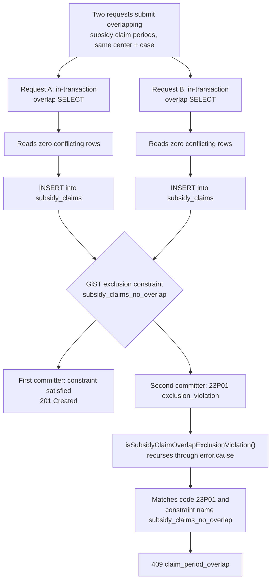

# Concurrency and database constraints

Two of PebbleDesk's rules could not be enforced correctly in application code. Both ended up as
Postgres GiST exclusion constraints. This is the write-up of why, what that cost, and how the API
was changed to keep returning a sensible error afterwards.

## Contents

- [The TOCTOU race that mattered](#the-toctou-race-that-mattered)
- [Why the obvious constraint does not compile](#why-the-obvious-constraint-does-not-compile)
- [Refusing to install on dirty data](#refusing-to-install-on-dirty-data)
- [Translating 23P01 back into a 409](#translating-23p01-back-into-a-409)
- [The second constraint: shifts, and different range semantics](#the-second-constraint-shifts-and-different-range-semantics)
- [Where the guarantee ends](#where-the-guarantee-ends)

Files referenced throughout:

| Path | Lines |
|---|---|
| [`packages/db/drizzle/0067_subsidy_claim_no_overlap.sql`](../packages/db/drizzle/0067_subsidy_claim_no_overlap.sql) | 53 |
| [`packages/db/drizzle/0066_shifts_no_overlap.sql`](../packages/db/drizzle/0066_shifts_no_overlap.sql) | 55 |
| [`apps/api/src/routes/subsidy-claims.ts`](../apps/api/src/routes/subsidy-claims.ts) | 548 |
| [`apps/api/src/routes/subsidy-claims.test.ts`](../apps/api/src/routes/subsidy-claims.test.ts) | 1,806 |

---

## The TOCTOU race that mattered

A subsidy claim is a request for public money. A center enrols a child whose care is subsidised by
a state programme, and each month it claims for a period of attendance. The claim carries a
`center_id`, a `subsidy_case_id`, and an inclusive period `[period_start, period_end]`.

The rule is that for one subsidy case, claim periods must not overlap. If they do, the same days of
care get billed twice. That is not a cosmetic data-quality problem: it is duplicate billing
against a government programme, and it is the kind of thing that shows up in an audit years later.

The natural implementation is a read-then-write inside a transaction:

```ts
// Simplified from apps/api/src/routes/subsidy-claims.ts
const conflicting = await tx.select().from(subsidyClaims).where(
  and(
    eq(subsidyClaims.centerId, centerId),
    eq(subsidyClaims.subsidyCaseId, caseId),
    lte(subsidyClaims.periodStart, periodEnd),
    gte(subsidyClaims.periodEnd, periodStart),
  ),
);
if (conflicting.length > 0) return badRequest("claim_period_overlap");
await tx.insert(subsidyClaims).values(...);
```

This is wrong, and it is wrong in a way that testing rarely catches. Under Postgres's default
`READ COMMITTED` isolation, two concurrent requests for adjacent-but-overlapping periods can both
run their `SELECT`, both see zero conflicting rows, and both `INSERT`. Neither transaction can see
the other's uncommitted row, and there is no row to lock: the conflict is between a row that
exists and a row that does not exist yet. `SELECT ... FOR UPDATE` does not help for the same
reason: you cannot lock the absence of a row.

The available fixes are `SERIALIZABLE` isolation, an advisory lock on the subsidy case, or a
database constraint. The constraint was chosen because it is the only one of the three that remains
true regardless of how the row got written: a future migration script, a manual `psql` session, or
a second service would all be subject to it, and none of them would honour an advisory-lock
convention they did not know about.

The comment in the route says this directly:

> The in-transaction overlap read below cannot stop two concurrent requests from each passing their
> read and both inserting. The `subsidy_claims_no_overlap` GiST exclusion constraint (migration
> 0067) is the race-safe backstop.

The application-level check was kept anyway. It is not redundant: it produces a clean, specific 409
on the overwhelmingly common non-concurrent path, without paying for a constraint violation and a
transaction abort. The constraint is the correctness guarantee; the read is the ergonomics.



Both requests pass the read the same way: that is the point of the race. The exclusion constraint
is the only thing in this diagram that is actually serialized: Postgres evaluates it per row as each
transaction commits, so one request's `INSERT` always lands first and the second is the one that
fails. Which request wins is not deterministic; that the loser gets a clean `409` instead of a
corrupted double-billed row is what the rest of this document is about.

## Why the obvious constraint does not compile

Postgres has exactly the right tool: an exclusion constraint. It generalises `UNIQUE` from equality
to any commutative operator, so "no two rows where the centers are equal, the cases are equal, and
the periods overlap" is directly expressible with the range overlap operator `&&`.

The obvious version:

```sql
-- Does not work.
ALTER TABLE "subsidy_claims" ADD CONSTRAINT "subsidy_claims_no_overlap"
  EXCLUDE USING gist (
    "center_id" WITH =,
    "subsidy_case_id" WITH =,
    (daterange("period_start"::date, "period_end"::date, '[]')) WITH &&
  );
```

Postgres rejects this with `functions in index expression must be marked IMMUTABLE`.

The reason is `DateStyle`. Casting `text` to `date` is marked `STABLE`, not `IMMUTABLE`, because
the result depends on a session GUC: `'01/02/2026'` is January 2nd under `DateStyle = 'ISO, MDY'`
and February 1st under `'ISO, DMY'`. An index or constraint expression must produce the same value
forever, or the index silently stops matching the data it indexes. Postgres therefore refuses any
non-immutable function in that position, and it is right to.

The dates in this schema are stored as `text` in `YYYY-MM-DD` form. The shipped constraint takes
them apart with `substr`, casts the pieces to `integer`, and reassembles them with `make_date`:
every one of which is `IMMUTABLE`, because none of them consults a session setting:

```sql
ALTER TABLE "subsidy_claims"
  ADD CONSTRAINT "subsidy_claims_no_overlap"
  EXCLUDE USING gist (
    "center_id" WITH =,
    "subsidy_case_id" WITH =,
    (daterange(
      make_date(substr("period_start", 1, 4)::integer, substr("period_start", 6, 2)::integer, substr("period_start", 9, 2)::integer),
      make_date(substr("period_end",   1, 4)::integer, substr("period_end",   6, 2)::integer, substr("period_end",   9, 2)::integer),
      '[]'
    )) WITH &&
  );
```

It is ugly, and the migration says so in a comment rather than leaving the next reader to rediscover
the constraint by trying the clean version first.

The `'[]'` bound argument is load-bearing. It makes the range inclusive at both ends, which is what
matches the schema's own `period_start <= period_end` check and the application-level comparison
using `<=` / `>=`. With the default `'[)'`, a claim ending on the 31st and one starting on the 31st
would not be considered overlapping, and the constraint would disagree with the route that feeds
it: the worst possible outcome, because the two checks would each be individually defensible.

Exclusion constraints over a mix of equality and overlap need `btree_gist`, since GiST has no
native operator class for plain equality on `uuid`. The migration creates the extension itself
rather than assuming it:

```sql
CREATE EXTENSION IF NOT EXISTS "btree_gist";
```

## Refusing to install on dirty data

Adding a constraint to a populated table either succeeds or fails partway through a deploy. The
migration front-loads that with an explicit guard: before touching anything, it self-joins
`subsidy_claims` and raises if any overlapping pair already exists.

```sql
DO $$
BEGIN
  IF EXISTS (
    SELECT 1 FROM "subsidy_claims" a
    JOIN "subsidy_claims" b
      ON a."center_id" = b."center_id"
     AND a."subsidy_case_id" = b."subsidy_case_id"
     AND a."id" < b."id"
     AND daterange(...) && daterange(...)
  ) THEN
    RAISE EXCEPTION 'Cannot add subsidy_claims_no_overlap: overlapping claim periods already exist';
  END IF;
END $$;
```

The `a."id" < b."id"` predicate is what stops every row from matching itself and stops each genuine
pair from being reported twice.

The migration also sets its own timeouts at the top:

```sql
SET lock_timeout = '5s';
SET statement_timeout = '120s';
```

Building a GiST index takes an `ACCESS EXCLUSIVE` lock on the table. Without `lock_timeout`, a
migration that arrives behind a long-running transaction waits for that lock, and every subsequent
query queues behind the waiting migration: a brief lock wait turns into a full table outage. Five
seconds means it gives up and the deploy fails loudly instead.

## Translating 23P01 back into a 409

Once the constraint exists, the losing side of a race gets a Postgres `exclusion_violation`, SQLSTATE
`23P01`. Left alone that surfaces as a 500, which is both wrong (the client's request was
perfectly well-formed, it just lost) and unhelpful.

The route detects it and maps it onto the same `409 claim_period_overlap` that the non-concurrent
path returns. The detection is narrower than it first appears:

```ts
function isSubsidyClaimOverlapExclusionViolation(error: unknown): boolean {
  if (typeof error !== "object" || error === null) return false;

  const code = (error as { code?: unknown }).code;
  const constraint = (error as { constraint?: unknown }).constraint;
  const message = (error as { message?: unknown }).message;
  if (
    code === "23P01" &&
    (constraint === "subsidy_claims_no_overlap" ||
      (typeof message === "string" && message.includes("subsidy_claims_no_overlap")))
  ) {
    return true;
  }

  if ("cause" in error) {
    return isSubsidyClaimOverlapExclusionViolation((error as { cause?: unknown }).cause);
  }

  return false;
}
```

Two details are deliberate.

It recurses through `cause`. The Neon serverless driver wraps the original `DatabaseError` before it
reaches the route, and Drizzle may wrap it again, so the `code` property is not on the object that
is actually thrown. A non-recursive check passes its unit test against a synthetic error object and
then fails in production against a real one.

It matches on the constraint name, not just the SQLSTATE. `23P01` only says "some exclusion
constraint was violated". `subsidy_claims` carries just one today, so the extra check buys nothing
immediately: it is there so that adding a second exclusion constraint later cannot silently
relabel a new failure as "claim period overlap". Mislabelling a novel error as a known business
error is worse than a 500, because a 500 gets investigated and a 409 gets handled.

Both branches are tested, for `POST` and for `PATCH`, and so is each failure mode separately:

```text
subsidy-claims.test.ts:190   maps the subsidy_claims_no_overlap exclusion violation (23P01) to a 409
subsidy-claims.test.ts:246   unwraps a driver-nested cause chain to map 23P01 to 409
subsidy-claims.test.ts:299   re-throws a non-23P01 DB error from the claim insert as a 500
subsidy-claims.test.ts:1690  PATCH maps the exclusion violation to a 409
subsidy-claims.test.ts:1753  PATCH re-throws a non-23P01 DB error as a 500
```

The tests simulate the case the application check cannot reach: the in-transaction read returns no
conflict, and the insert still raises. That is the only way to exercise the losing side of the race
without actually racing. The pair at `:299` and `:1753` matter as much as the happy path: they are
what stops the handler from swallowing unrelated database failures into a friendly 409.

`grep -c "it(" apps/api/src/routes/subsidy-claims.test.ts` reports **47** test cases in this file.

## The second constraint: shifts, and different range semantics

Staff scheduling has the same shape of problem: one staff member must not be rostered onto two
overlapping shifts. `0066_shifts_no_overlap.sql` applies the same technique with the same
`IMMUTABLE` workaround, and one deliberate difference.

Shift times are stored as `HH:MM` text. They are converted to minutes-since-midnight integers and
compared as a `numrange` rather than a `daterange`:

> The time range is modelled as a numrange over minutes-since-midnight derived from the `"HH:MM"`
> text columns. […] `numrange` defaults to `'[)'` which gives the same half-open overlap semantics
> as the application check.

The default `'[)'` bound is correct here and would be wrong for claims. A shift ending at 12:00 and
one starting at 12:00 do not overlap: that is a handover, and it happens at every shift change in
every center. A subsidy claim period ending on the 31st and one starting on the 31st *does* overlap,
because a claim period is a set of billed days and the 31st would be billed twice.

Same technique, opposite bound, because the domain says so. Getting this backwards in either
direction produces a constraint that is quietly wrong rather than obviously broken: shifts that
refuse to be scheduled at normal handover times, or subsidy days that get billed twice.

## Where the guarantee ends

This technique closes one specific class of race, not every one:

**It is not a substitute for `SERIALIZABLE` in general.** Exclusion constraints solve conflicts that
can be expressed as a predicate over pairs of rows in one table. Anything involving an aggregate
across rows ("total claimed for this case must not exceed the award") is not expressible this way,
and PebbleDesk did not solve that case.

**The error path is only as good as its detection.** The `cause`-chain recursion is a workaround for
driver wrapping, and it is coupled to how the driver happens to nest errors. A driver upgrade that
changed the wrapping shape would turn a tested 409 back into a 500, and the existing tests (which
construct the nested error themselves) would still pass.

**Only two tables got this treatment.** Attendance check-ins have a comparable overlap question
(one child, two open check-ins) that is enforced only in application code, without the database-level
backstop subsidy claims and shifts have.

**The race was never observed, only reasoned about.** Nothing in this repository is a concurrency
test: the two `23P01` cases construct the driver error by hand rather than racing two real
requests, and there is no load harness that would produce a genuine collision. The constraint is
correct by argument and by Postgres's own semantics, not by demonstration. A test that spawns
concurrent inserts against a real database and asserts exactly one survives would have closed that
gap, and was never written.

**The `lock_timeout` reasoning is untested here too.** Setting it is right, but no migration in this
repository is recorded as having contended for the lock, so the five-second value is a considered
default rather than a tuned one.

---

Related: [COMPLIANCE-MODEL.md](./COMPLIANCE-MODEL.md) for the ratio rules and audit log ·
[TESTING.md](./TESTING.md) for what the suite does and does not cover ·
[METRICS.md](./METRICS.md) for the commands behind every number here.
